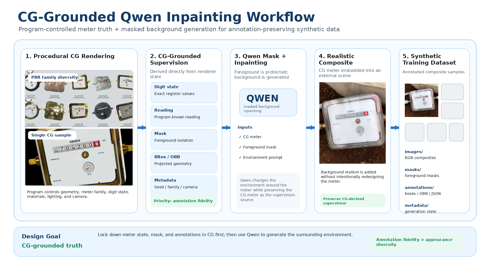
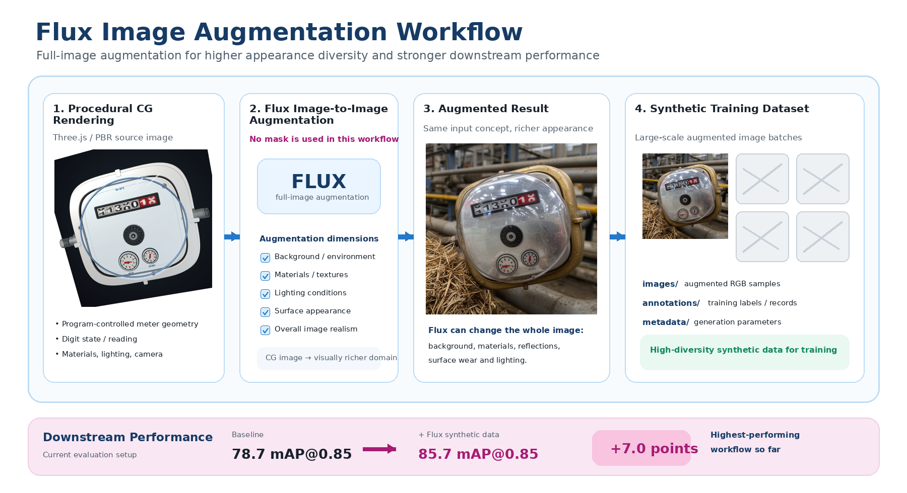

# Water-Meter perception system

A synthetic-data and perception pipeline for mechanical water-meter reading.

The project addresses a practical data problem: collecting and labeling large-scale real-world water-meter images is expensive, while difficult cases such as partially rolling digits, varying meter designs, lighting changes, and background clutter are underrepresented in small real datasets.

This system uses procedural 3D rendering to generate controllable water-meter scenes together with exact annotations, then optionally applies generative refinement to improve visual realism while preserving the underlying meter state.

The synthetic-data pipeline has already shown measurable downstream value: on our evaluation setup, augmenting training with generated data improved detector performance from **78.7% mAP@0.85 to 85.7% mAP@0.85**.





## Core Idea
Workflow1:

Procedural Meter Configuration
        ↓
Three.js CG Rendering
        ↓
Exact Meter State + Masks + Annotations
        ↓
Qwen Background Inpainting
        ↓
Realistic Composite
        ↓
Synthetic Training Dataset

workflow2: 

Procedural Meter Configuration
        ↓
Three.js CG Rendering
        ↓
Flux Image-to-Image Augmentation
        ↓
Global Appearance Variation
        ↓
Synthetic Training Dataset


## Workers

Flux2 dashboard:

```bash
cd workers/flux2_worker
python3 massive_production.py
```

Qwen inpainting dashboard:

```bash
cd workers/qwen_inpainting_worker
python3 massive_production.py
```

With no arguments, each command starts its own localhost dashboard. Existing
CLI arguments are still supported when arguments are supplied.

- Flux2 dashboard: `http://127.0.0.1:9000`
- Qwen dashboard: `http://127.0.0.1:9001`

Both workers default to one ComfyUI instance at `http://127.0.0.1:8188`.
Route-specific endpoints and separate servers remain optional. GPU assignment
belongs to the deployment environment, not repository code. See
[`workers/README.md`](workers/README.md) for the output contract, variables,
model filenames, custom node class types, and CLI commands.

## Shared Production

`synthetic_core/cg_exporter` is the shared Three.js renderer and exporter used
directly by both workers. PBR assets, HDRIs, existing masks, common
configuration, and utilities are stored once under `synthetic_core`.

## Annotation Check

```bash
python3 validation/annotation_check/validate_coco_annotations.py
```

The validator selects one existing rendered image referenced by the existing
COCO file, draws its stored boxes/OBBs, and writes the result to
`validation/sample_results`. It never creates new annotations.
